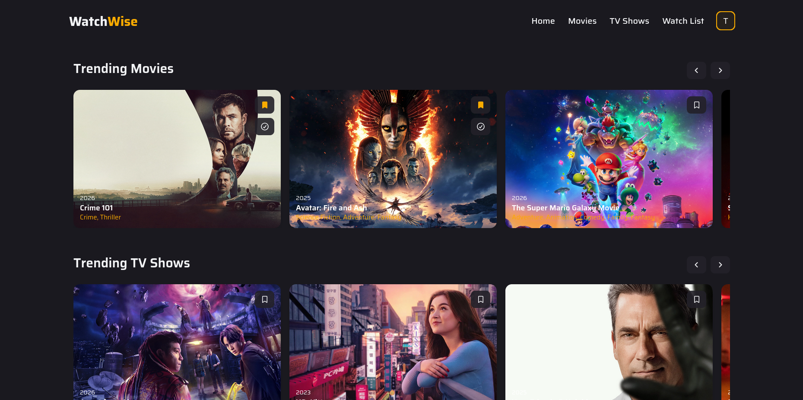
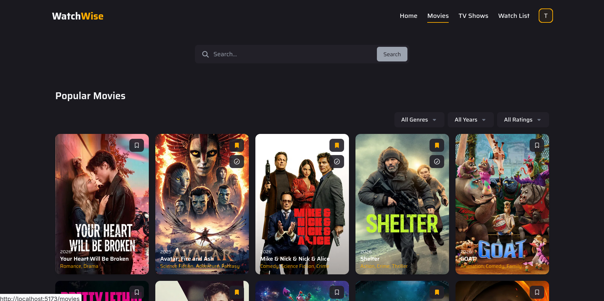

# WatchWise

**Live Demo:** [watchwise-app.netlify.app](https://watchwise-app.netlify.app/)

WatchWise is an open-source React application for discovering movies and TV shows, exploring detailed media information, and managing a personal watchlist. The project focuses on clean architecture, reusable UI components, and modern frontend development practices.

The app integrates with the TMDB API to fetch movie and TV show data and uses Firebase for authentication and persistent user watchlists.

## Screenshots

### Home Page


### Movies Page


## Features

- Browse **popular and trending movies and TV shows**
- View **detailed media pages** with trailers, cast, and related titles
- **Search and filter** media content
- **Personal watchlist** with add/remove functionality
- **Mark titles as watched or unwatched**
- **Random movie and TV show picker**
- **Firebase authentication** (register, login, logout)
- Responsive UI built with reusable components
- Feature-based folder architecture

## Tech Stack

- **React**
- **Vite**
- **React Router**
- **Firebase Authentication**
- **Firebase Firestore**
- **TMDB API**
- **Tailwind CSS**

## Project Structure

```text
src
├── app
│   ├── App.jsx
│   ├── pages
│   └── providers
├── components
│   ├── cards
│   ├── forms
│   ├── icons
│   ├── layout
│   ├── routes
│   └── ui
├── features
│   ├── auth
│   ├── home
│   ├── media
│   ├── mediaDetails
│   └── watchlist
├── services
│   ├── api
│   └── firebase
├── styles
└── utils
```

## Getting Started

### Prerequisites

- Node.js 18+
- npm
- A TMDB API key
- A Firebase project

### Installation

```bash
git clone git@github.com:MedBouali/movie-watchlist-react.git
cd movie-watchlist-react
npm install
```

### Environment Variables

Create a `.env` file in the project root:

```env
VITE_TMDB_API_KEY=your_tmdb_api_key

VITE_FIREBASE_API_KEY=your_firebase_api_key
VITE_FIREBASE_AUTH_DOMAIN=your_firebase_auth_domain
VITE_FIREBASE_PROJECT_ID=your_firebase_project_id
VITE_FIREBASE_STORAGE_BUCKET=your_firebase_storage_bucket
VITE_FIREBASE_MESSAGING_SENDER_ID=your_firebase_messaging_sender_id
VITE_FIREBASE_APP_ID=your_firebase_app_id
```

## Firebase Setup

1. Create a Firebase project.
2. Enable **Authentication**.
3. Enable **Firestore Database**.
4. Add the Firebase configuration to `.env`.

User watchlists are stored per authenticated user in Firestore.

## TMDB API

This project uses the **The Movie Database (TMDB) API** for movie and TV show data.

Steps:

1. Create an account on TMDB.
2. Generate an API key.
3. Add the key to your `.env` file.

More info: https://developer.themoviedb.org/docs/getting-started

## Scripts

| Command | Description |
|---------|-------------|
| `npm run dev` | Start development server |
| `npm run build` | Build production bundle |
| `npm run preview` | Preview production build |
| `npm run lint` | Run ESLint |

## License

This project is licensed under the MIT License.
